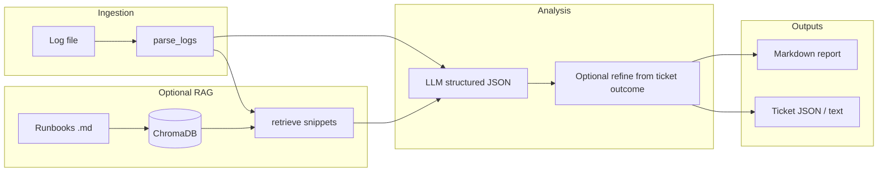

# AI Incident Intelligence

Python toolkit that ingests **system logs**, runs **LLM incident analysis** with optional **RAG grounding** (runbooks in ChromaDB) and an optional **ticket-outcome feedback loop**, then emits a **Markdown report** and **structured JSON** for ITSM / SOAR (title, description, severity, confidence, action tier, suggested actions, lessons learned).

## Deliberate scope (vs enterprise products)

Products like **IBM AIOps** or **incident.io** ship deep integrations (Slack, PagerDuty, Grafana, SSO, multi-tenant scale). This repo is a **portfolio-grade, inspectable pipeline**: same *shape* of workflow (detect → triage → document → ticket), with **clear extension seams** for webhooks and agents. It does **not** try to match their integration surface—that gap is acknowledged by design.

## Architecture



**Agentic loop (extensible):** `workflow/feedback_loop.py` implements a **second-pass** model call when a ticket is resolved (`--ticket-outcome`).  

**LangGraph workflow:** `workflow/langgraph_incident.py` compiles a small graph — **ingest → analyze → `poll_ticket_stub` → refine** — same outputs as the linear CLI. Run:

```powershell
pip install -r requirements-langgraph.txt
$env:AI_INCIDENT_USE_STUB="1"
python main.py --langgraph --log examples/sample_logs.txt --ticket-outcome examples/sample_ticket_outcome.json
```

`poll_ticket_stub` is the integration seam (replace with Jira/ServiceNow polling or a webhook handler). Use a **clean venv** if your global `langchain` packages conflict with `langgraph`.

## Workflow

```text
logs → parse → [optional RAG] → LLM analysis → [optional ticket feedback] → report + ticket JSON
```

## Structured outputs (enterprise-style)

The model returns JSON aligned for downstream systems:

| Field | Meaning |
|--------|--------|
| `severity_level` | `LOW` / `MEDIUM` / `HIGH` / `CRITICAL` |
| `confidence_score` | `0.0`–`1.0` (model self-assessment) |
| `action_tier` | `P1`–`P4` (operational escalation hint) |
| `recommended_actions` | Action list |
| `lessons_learned` | Populated especially after `--ticket-outcome` refinement |

CLI: `--out-analysis-json` and `--out-ticket-json` write these to disk.

## Project layout

| Path | Purpose |
|------|---------|
| `ingestion/` | Log parsing, important-events JSON |
| `grounding/` | Chroma runbook ingest + retrieval |
| `analysis/` | OpenAI structured incident JSON |
| `workflow/` | Ticket-outcome refinement; `langgraph_incident.py` (optional graph) |
| `pipeline_result.py` | Shared `PipelineResult` for linear + LangGraph paths |
| `requirements-langgraph.txt` | Optional: LangGraph (use with `--langgraph`) |
| `reporting/` | Markdown report |
| `tickets/` | Structured ticket + paste-friendly text |
| `main.py` | CLI + `run_pipeline()` |
| `api.py` | Optional FastAPI wrapper (`--serve`); lazy fastapi/uvicorn imports |
| `requirements-api.txt` | Optional: FastAPI service mode (`--serve`) |
| `examples/runbooks/` | Sample runbook for RAG demos |
| `examples/sample_ticket_outcome.json` | Sample closure payload for refinement |

## Requirements

- Python 3.10+
- `pip install -r requirements.txt` → `openai`, `chromadb` (Chroma only used when `--runbook-dir` is set)

## Setup

```powershell
cd ai-incident-intelligence
python -m venv .venv
.\.venv\Scripts\Activate.ps1
pip install -r requirements.txt
```

### Environment

| Variable | Purpose |
|----------|---------|
| `OPENAI_API_KEY` | Live LLM (strip trailing newline) |
| `OPENAI_MODEL` | Optional; default `gpt-4o-mini` |
| `AI_INCIDENT_USE_STUB` | `1` / `true` — no API calls |

## How to run locally

```powershell
# Demo without API key
$env:AI_INCIDENT_USE_STUB="1"
python main.py --log examples/sample_logs.txt

# Optional: ground analysis on runbooks (needs chromadb)
python main.py --log examples/sample_logs.txt --runbook-dir examples/runbooks

# Optional: refine using a “resolved ticket” JSON (feedback loop)
python main.py --log examples/sample_logs.txt --ticket-outcome examples/sample_ticket_outcome.json

# Save artifacts
python main.py --log examples/sample_logs.txt --out-report report.md --out-ticket-json ticket.json --out-analysis-json analysis.json -q
```

Other flags: `--max-llm-lines`, `--max-report-log-lines`, `--chroma-path`, `-q` / `--quiet`.

## API service mode

The same pipeline is available over HTTP via an optional FastAPI wrapper (`api.py`). The extra dependencies are kept separate, and `fastapi`/`uvicorn` are imported lazily — the CLI and tests work without them:

```powershell
pip install -r requirements-api.txt
python main.py --serve --host 127.0.0.1 --port 8000
```

`POST /analyze` accepts either a JSON body (`log_text`, optional `runbook_dir`, optional inline `ticket_outcome` object) or a multipart log-file upload, and returns the structured `analysis`, structured `ticket`, and `report_markdown`. Example:

```bash
curl -s -X POST http://127.0.0.1:8000/analyze \
  -H "Content-Type: application/json" \
  -d '{"log_text": "2025-04-06T14:22:07Z [ERROR] postgres-primary[18234]: connection pool exhausted\nERROR Database connection timeout"}'

# Or upload a log file:
curl -s -X POST http://127.0.0.1:8000/analyze -F "file=@examples/sample_logs.txt"
```

Set `AI_INCIDENT_USE_STUB=1` before starting the server for offline demo responses.

## Sample log input (excerpt)

```text
2025-04-06T14:22:07Z [ERROR] postgres-primary[18234]: connection pool exhausted active=100 max=100
2025-04-06T14:22:08Z [ERROR] api-gateway: request failed path=/v1/orders status=503 trace_id=a1b2c3
ERROR Database connection timeout
```

(Full file: `examples/sample_logs.txt`.)

## Sample Markdown report (stub / truncated)

```markdown
# Incident Report

## Severity
**HIGH**

## Confidence score
**0.78** _(0–1; model self-assessment, not a statistical guarantee)_

## Action tier (P1–P4)
**P2** — P1 immediate / exec risk, P2 urgent engineering, P3 standard queue, P4 informational.

## Incident summary
Multiple API errors and database connection limits observed…
```

## Sample ticket JSON (shape)

```json
{
  "title": "[HIGH] Multiple API errors and database connection limits…",
  "severity": "HIGH",
  "confidence_score": 0.78,
  "action_tier": "P2",
  "suggested_actions": ["Inspect DB max connections…"],
  "lessons_learned": "",
  "description": "…"
}
```

## Programmatic API

```python
from pathlib import Path
from main import run_pipeline

r = run_pipeline(
    Path("examples/sample_logs.txt"),
    runbook_dir=Path("examples/runbooks"),
    ticket_outcome_path=Path("examples/sample_ticket_outcome.json"),
)
print(r.analysis.to_dict())
print(r.ticket.to_dict())
```

## License

MIT. See `LICENSE`.

## Verification

The default automated suite is fully offline and never requires an API key:

```powershell
pip install -r requirements-dev.txt
pytest -q
$env:AI_INCIDENT_USE_STUB="1"
python main.py --log examples/sample_logs.txt -q
```

GitHub Actions runs the parser, normalization, structured ticket, report, and end-to-end stub pipeline checks for every push and pull request.
